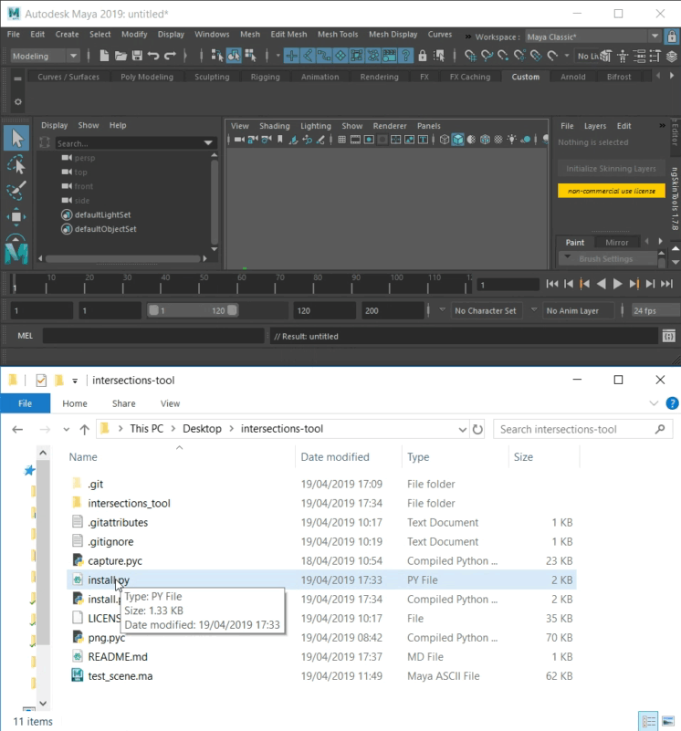
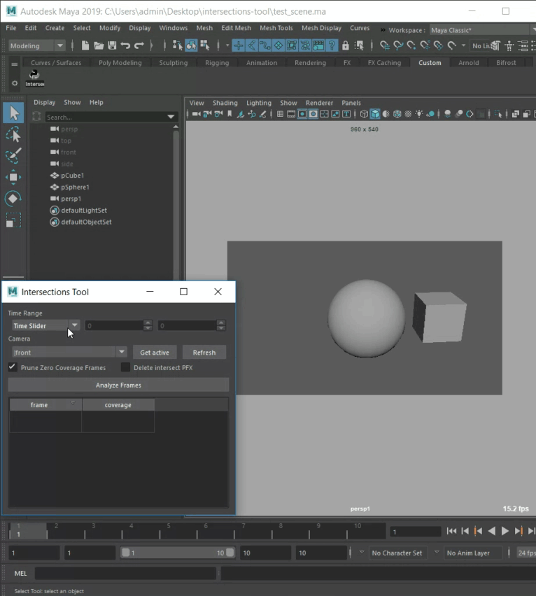

# intersections-tool

This is a tool for analyzing and spotting mesh intersections. Original idea by [Marcus](https://github.com/mottosso) from [Avalon](https://github.com/getavalon/core/issues/177#issuecomment-307706114)

## Installation

1. Download and unzip the *intersections-tool.zip* file from [github releases](https://github.com/tokejepsen/intersections-tool/releases).

2. Drag and drop the "intersections-tool/install.py" file onto the Maya viewport.

3. Click the Intersections Tool icon on the shelf to run.



## Usage

1. Set your time range with either; ```Time Slider```, ```Start/End``` or ```Current Frame```.

2. Select your camera.

3. Analyze the frames.

4. Jump to frames with intersections.



### Analyze with code

```
>>> import intersections_tool
>>> coverage = intersections_tool.lib.get_coverage()
>>> print coverage
[[3.0, 0.004325], [4.0, 0.0042356]]
```
The analysis of frames happens by finding a 0-1 value per frame of how much the intersections cover the screen. A list of lists is returned that shows the frame and the coverage value.

More details about the arguments for the coverage method can be found in the method description:
```
>>> print help(intersections_tool.lib.get_coverage)
```

## Vendors

- [maya-capture](https://github.com/abstractfactory/maya-capture)
- [PyPNG](https://github.com/drj11/pypng)
- [Qt.py](https://github.com/mottosso/Qt.py)
